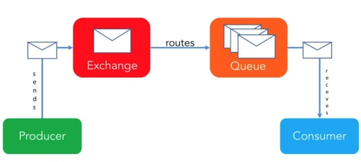

# RabbitMQ

É um software open source de mensageria (*Message Broker*). Fornece uma forma comunicação assíncrona de dados entre processos, aplicações ou servidores. É um dos brokers de mensagens mais utilizados e implementa o protocolo AMQP — Advanced Message Queueing Protocol.

O RabbitMQ é um agente de mensagens de uso geral que prioriza a entrega de mensagens de ponta a ponta.

Permite que criemos sistemas escaláveis e independentes entre si. Mesmo se os servidores, que estão ouvindo o tópico, ficarem offline, as mensagens, ficaram salvas para serem processadas depois.

## Caso de uso
O caso de uso do RabbitMQ, se dá quando se deseja utilizar **arquitetura microservices**, quando um serviço precisa se comunicar com outro serviço, e essa comunicação não pode ser feita via API Web HTTP, pois a chamada API Web HTTP, requer obrigatoriamente uma chamada de sucesso, logo, ela é síncrono, diferente do RabbitMQ, que é assíncrono, e não obriga uma resposta/processamento imediato.

## Como funciona
Como toda comunicação, precisamos de um produtor, de uma mensagem e de um receptor. No meio do bolo fica o RabbitMQ, que seria o lugar onde fica a mensagem esperando pelo receptor.

Um conceito importante para evitar dores de cabeça lá na frente é que não enviamos a mensagem para uma fila diretamente e sim para um **exchange**, que será o encarregado de encaminhar para a fila correta. E a mágica para entender o Rabbit está em entender como funciona esse encaminhamento, esse *routing*.

Antes de explicar melhor o que o *exchange* faz, precisamos esclarecer três conceitos:

- **Binding**: É a ligação entre uma fila e um *exchange*
- **Binding key**: É uma chave específica da ligação entre a fila e o *exchange*
- **Routing key**: É uma chave enviada junto a mensagem que o *exchange* usa para decidir para que fila (ou filas) vai rotear uma mensagem.

### Exchanges
As mensagens não são publicadas diretamente numa fila. O produtor (*producer*) envia a mensagem para o exchange, junto com o *routing key* (não é obrigatório) e o *exchange* encaminha para as filas em função da configuração.

Tipos de *exchange*:

- **Direct**: O *Direct Exchange* encaminha as mensagens procurando por um *binding key* igual ao *routing key* fornecido. Vale salientar que se o exchange não consegue encaminhar a mensagem para uma fila, ela será descartada.
- **Topic**: *Topic Exchange* funciona de uma forma parecida ao *Direct*, porém o *binding key* é um tipo de “expressão regular” aplicada sobre o *routing key*. Para ser mais fácil de entender, poderíamos fazer uma analogia com as tags do *post*. O *routing key* da mensagem seria a lista de tags separadas por pontos (por exemplo “kotlin.rabbitmq.tecnologia”). Os *bindings* poderiam filtrar por tipo, e cada fila só receberia aqueles posts que acharem interessantes, por exemplo “#.kotlin.#” ou “#.tecnologia.#”.
- **Fanout**: O *Fanout Exchange* encaminha para todas as filas com *binding* nele, desconsiderando *routing key*.
- **Headers**: O *Headers Exchange* usa os valores do header da mensagem para fazer o encaminhamento, ignorando o *routing key*. É parecido ao *Topic* mas permite um controle mais fino. A mensagem pode dizer se os *headers* precisam ser iguais à *binging key* ou se só um *header* igual já é motivo suficiente para encaminhar.

## Consumo de mensagens
No RabbitMQ, o agente garante que os consumidores recebam a mensagem. O aplicativo para consumidores assume um papel passivo e espera que o agente do RabbitMQ coloque a mensagem na fila. 

Por exemplo, um aplicativo bancário pode esperar por alertas de SMS do software central de processamento de transações.

## Prioridade da mensagem
Os agentes do RabbitMQ permitem que o software do produtor privilegiem determinadas mensagens usando a **fila prioritária**. Em vez de enviar mensagens na ordem *primeiro a entrar, primeiro a sair*, o agente processa mensagens de maior prioridade antes das mensagens normais. 

Por exemplo, um aplicativo de varejo pode enfileirar transações de vendas a cada hora. No entanto, se o administrador do sistema emitir uma mensagem de backup prioritário do banco de dados, o agente a enviará imediatamente.

## Ordenação de mensagens
O RabbitMQ envia e enfileira mensagens em uma ordem específica. A menos que uma mensagem de maior prioridade seja colocada em fila no sistema, os consumidores recebem mensagens na ordem em que foram enviadas.

## Exclusão de mensagens
Um agente do RabbitMQ encaminha a mensagem para a fila de destino. Depois de lido, o consumidor envia uma resposta de confirmação (ACK) ao agente, que então exclui a mensagem da fila.

## Entrega eficaz de mensagens
O RabbitMQ aplica o modelo push, ou seja, o produtor sabe se o aplicativo cliente consumiu a mensagem. Ele é adequado para aplicativos que devem seguir sequências específicas e garantias de entrega ao trocar e analisar dados.

## Fontes:
https://medium.com/dev-cave/rabbit-mq-parte-i-c15e5f89d94
https://medium.com/@ramonpaolo/o-que-%C3%A9-o-rabbitmq-e-como-utilizar-c3ce2406a983
https://aws.amazon.com/pt/compare/the-difference-between-rabbitmq-and-kafka/#:~:text=Kafka%20uses%20the%20binary%20protocol,and%20MQTT%20to%20route%20messages.